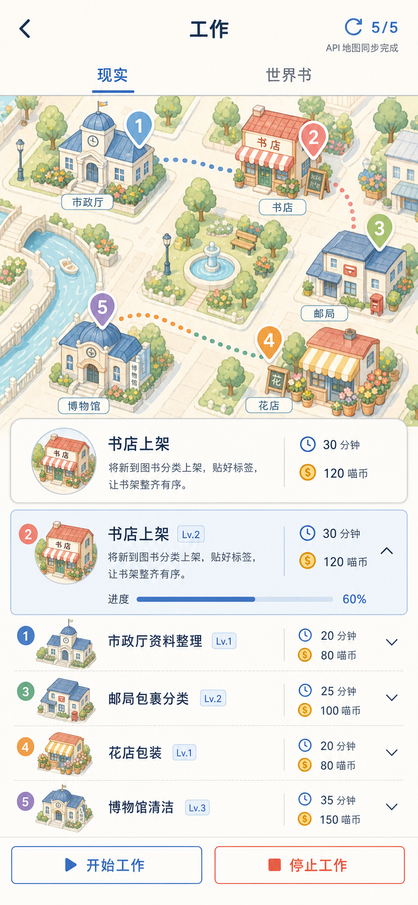
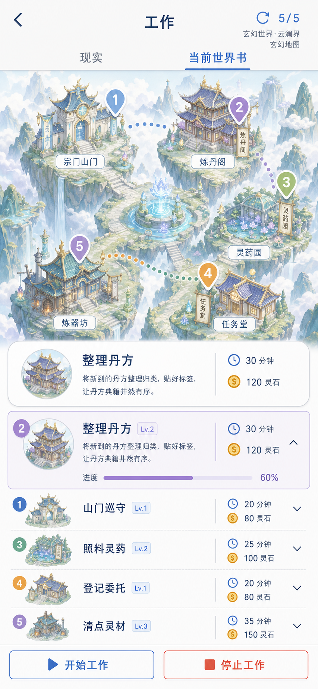

# 工作 APP 插画地图重设计规格

## 目标

将现有工作 APP 从黑白仪表盘式地图改为清新、可爱的城市街区插画，同时保留 API 生成工作、任务选择、计时、停止、结算和钱包入账等完整能力。

工作 APP 同时连接世界书。选择世界书后，底图、建筑、地点和工作内容必须切换为对应世界主题，不能在古代或玄幻世界继续显示现代城市。

视觉目标采用已确认的第 6 版方案：



玄幻世界采用同一排版但替换整套地图主题：



## 核心原则

1. 地图先定义可用地点，API 再基于地点生成工作。
2. 建筑、点位标签、工作名称、图标和任务详情必须来自同一份结构化数据。
3. API 刷新只更新数据和建筑组合，不实时生成图片。
4. 地图可爱但不幼稚，信息层级清楚，按钮和文字保持可读。
5. 不改动工作计时、停止结算、完成领取和钱包入账规则。
6. 世界主题切换必须替换完整底图、建筑素材和工作词库，不只替换图标或颜色。

## 页面结构

### 顶部导航

- 遵守 iOS 顶部安全区。
- 左侧为返回按钮，中间为“工作”，右侧为刷新次数或付费刷新。
- 刷新按钮下方可短暂显示“地图同步完成”或“生成中”。
- 来源切换仅保留“现实”和“当前世界书”两个文字标签，不使用大卡片。
- 点击“当前世界书”可从用户创建的世界书中选择一个世界。
- 选中世界书后显示世界名称和地图主题；删除世界书时，工作 APP 自动回到现实来源。

### 插画地图

- 每种地图主题使用独立的完整底图，底图包含该世界对应的地形、道路、水域、天空和环境氛围。
- 建筑为独立透明插画素材，叠加在固定地图锚点上。
- 每轮显示 5 个工作地点，地图点位和建筑一起更新。
- 选中的工作使用更明显的点位颜色、虚线路线和轻量高亮。
- 地图不显示雷达盘、圆形仪表或扫描动画。

### 工作详情

- 地图下方显示当前工作的地点、工作标题、简短描述、时长、报酬和等级。
- 五个工作使用一个分组列表与分隔线，不做五张独立卡片。
- 当前工作行展开并显示进度，其他工作保持紧凑。
- 底部固定“开始工作”和“停止工作”，确保不被底部安全区遮挡。

## 插画素材库

首版内置 12 类建筑素材，每类对应稳定的 `placeType`：

| placeType | 建筑 | 可生成工作示例 |
| --- | --- | --- |
| `bookstore` | 书店 | 图书上架、资料整理、陈列维护 |
| `flower_shop` | 花店 | 花束包装、鲜花照料、陈列整理 |
| `clinic` | 诊所 | 临时陪护、资料录入、候诊引导 |
| `parcel_station` | 快递站 | 包裹分拣、社区配送、取件协助 |
| `cafe` | 咖啡馆 | 桌面整理、备料协助、闭店清洁 |
| `museum` | 博物馆 | 展品清洁、展厅引导、资料归档 |
| `city_hall` | 市政厅 | 资料审核、表单整理、信息录入 |
| `market` | 市场 | 代购、摊位整理、库存清点 |
| `apartment` | 公寓 | 空间清洁、物品归位、搬运协助 |
| `workshop` | 工坊 | 设备检修、制作协助、工具整理 |
| `community_center` | 社区中心 | 活动协助、社区调研、接待登记 |
| `night_kiosk` | 夜间岗亭 | 夜间巡检、值班记录、安全检查 |

每个素材使用统一透视、描边、光线和色彩，允许按地图位置做小幅缩放，不拉伸或裁切建筑主体。

## 世界书地图主题

世界书编辑页新增 `workMapTheme` 字段，默认根据世界书的 `genre` 和 `tone` 自动推荐，用户可以手动覆盖。

| workMapTheme | 完整底图 | 建筑与地点示例 |
| --- | --- | --- |
| `modern` | 现代街区、河流、公园、道路 | 书店、诊所、快递站、咖啡馆、社区中心 |
| `ancient_cn` | 古代城坊、河道、牌楼、青瓦街巷 | 衙门、客栈、医馆、书院、镖局、集市 |
| `xuanhuan` | 云海、浮山、灵泉、石阶、古桥 | 宗门山门、炼丹阁、灵药园、任务堂、炼器坊 |
| `western_fantasy` | 城墙、森林、石桥、魔法溪谷 | 城堡、公会、魔法学院、药剂店、铁匠铺 |
| `scifi` | 空间港、舱道、能源河、模块平台 | 研究舱、维修坞、贸易港、导航站、生态舱 |
| `wasteland` | 荒原、废墟道路、防护墙、补给路线 | 避难所、补给站、医疗营地、巡逻哨、修理站 |

每个主题包由以下内容组成：

1. 一张不含任务文字的完整主题底图。
2. 至少 8 个独立透明建筑素材。
3. 对应的地点白名单、同义词和工作词库。
4. 主题色、路线色、点位色和环境装饰规则。

切换主题时一次性替换整个主题包。API 不生成图片，只选择主题包中允许的地点并生成对应工作。

### 主题自动匹配

- `genre` 包含古代、宫廷、武侠、江湖时，推荐 `ancient_cn`。
- `genre` 包含玄幻、仙侠、修真、高魔东方时，推荐 `xuanhuan`。
- `genre` 包含西幻、魔法、中世纪时，推荐 `western_fantasy`。
- `genre` 包含科幻、星际、赛博、未来时，推荐 `scifi`。
- `genre` 包含末世、废土、灾变时，推荐 `wasteland`。
- 其他情况推荐 `modern`，但用户可在世界书编辑页立即修改。

## API 数据协议

API 每轮必须返回 5 个工作，并从允许的 `placeType` 中选择：

```json
{
  "jobs": [
    {
      "placeType": "bookstore",
      "placeName": "青禾书店",
      "title": "新书上架",
      "content": "按分类摆放新书并补齐书架标签",
      "durationMinutes": 90,
      "hourlyRate": 45,
      "reward": 70,
      "level": 2,
      "icon": "bookstore"
    }
  ]
}
```

应用根据 `placeType` 选择建筑、图标、地图锚点和可用标题，不接受 API 自由描述不存在的建筑。

当来源为世界书时，请求同时携带：

- 世界书 `id`、名称、`genre`、`tone` 和主要设定。
- 用户选择或系统推断的 `workMapTheme`。
- 当前主题允许使用的地点列表与工作范围。

例如 `xuanhuan` 主题只允许生成山门巡守、整理丹方、照料灵药、登记委托、清点灵材等工作，不允许出现咖啡馆、快递站或现代设备。

## 数据校验与兜底

1. 验证 `placeType` 是否属于 12 类地点。
2. 验证工作标题是否符合该地点的允许工作范围。
3. 对常见同义词做映射，例如“图书馆”可映射为 `bookstore`，“卫生站”可映射为 `clinic`。
4. 无法映射的单条工作使用本地同地点工作替换，避免整轮失败。
5. API 完全不可用时，使用本地工作生成器，并遵守同一地点协议。
6. 五个工作尽量使用不同地点；重复地点允许，但地图上使用不同锚点并保持名称一致。
7. API 返回的工作与当前 `workMapTheme` 冲突时，视为无效工作并用同主题本地工作替换。

## 状态与交互

- `loading`：刷新按钮显示生成中，保留上一轮地图，避免空白闪烁。
- `ready`：一次性替换五个工作、建筑和点位。
- `source-change`：切换现实或世界书后，先替换完整底图，再生成该主题的工作；加载期间不混用上一个主题的建筑。
- `selected`：点击地图点位或列表行时，两处同步选中。
- `running`：锁定刷新和工作切换，持续更新时间与进度。
- `completed`：主按钮改为领取报酬，领取后生成下一轮工作。
- `error`：API 失败时无中断感地使用本地数据，并显示短暂提示。

## 视觉系统

- 背景：奶白色与极浅蓝灰。
- 主色：粉蓝色和深海军蓝。
- 辅色：薄荷绿、柔桃色、奶油黄、浅紫色，用于区分地点。
- 插画：微缩街区、圆润屋顶、条纹雨棚、花盆、长椅和路灯；不使用动物或吉祥物。
- 质感：低噪点、少纹理、平滑明暗、清晰边缘。
- 圆角：仅用于任务详情、选中行和主要操作，不把所有内容做成胶囊。
- 图标：沿用项目现有 Lucide 图标，统一线宽。

## 响应式与安全区

- 顶部导航使用 `env(safe-area-inset-top)`，地图背景可延伸到安全区，但可点击内容位于灵动岛下方。
- 底部操作栏包含 `env(safe-area-inset-bottom)`，按钮主体不进入手势区。
- 重点验证 375px 小屏和当前 iPhone 长屏比例。
- 所有主要触控目标不小于 44 x 44px，相邻目标至少留 8px。
- 动画支持 `prefers-reduced-motion`。

## 验收标准

1. 每次 API 刷新后，五个工作与五个地图建筑完全对应。
2. API 返回异常地点时，界面不会显示错配建筑或空白点位。
3. 地图点位与任务列表可双向选择并保持同步。
4. 开始、停止、完成领取和钱包结算行为与现有版本一致。
5. iOS 刘海屏和灵动岛设备上，返回和刷新按钮可点击且不被遮挡。
6. 375px 宽度下文字不截断、按钮不重叠、底部操作不进入安全区。
7. 页面整体达到第 6 版视觉目标的可爱街区插画感，但不增加新的底部导航。
8. 选择古代、玄幻、西幻、科幻或末世世界书时，底图、建筑和工作内容整套切换，不残留现代地图元素。
9. 世界书编辑页可查看并修改“工作地图风格”，新建世界默认自动推荐。

## 测试范围

- API 响应解析、地点白名单、同义词映射和本地兜底单元测试。
- 世界书类型到地图主题的自动匹配与手动覆盖测试。
- 切换世界书时底图、建筑、地点白名单和工作提示词同步更新测试。
- 地图点位与列表选择同步测试。
- 运行中禁止刷新、停止按比例结算、完成领取测试。
- 小屏、长屏、安全区和减少动态效果的视觉检查。
- 构建后在本地与 GitHub Pages 实际页面验证。
